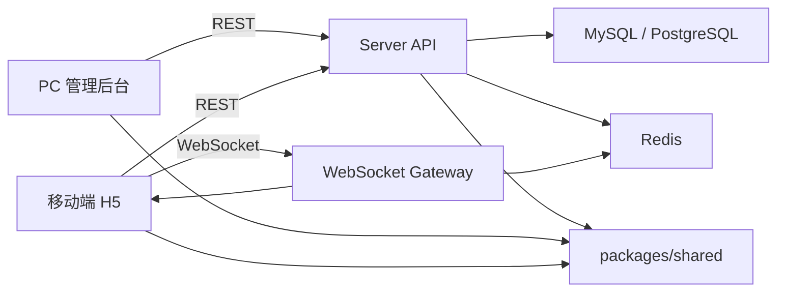
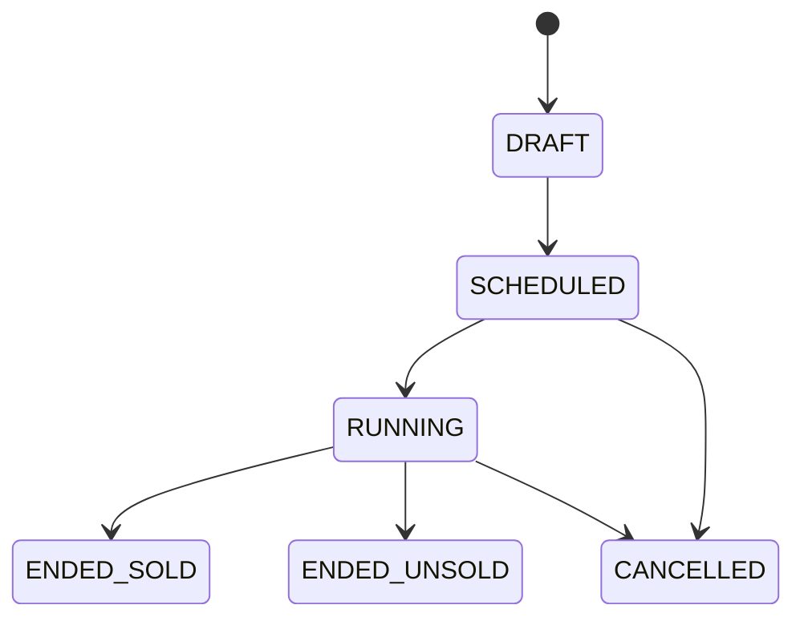

# 架构设计

本文档是 Day 1 架构初稿，描述直播竞拍系统的模块边界、数据流和关键一致性策略。后续实现时需要随代码更新。

## 1. 架构目标

- 跑通商品上架、规则配置、直播间展示、实时出价、动态排名、竞拍结束、成交订单闭环。
- 将竞拍状态机、出价校验、结算逻辑集中在服务端。
- 使用 Redis 承接高频出价热状态，数据库保存权威业务记录。
- WebSocket 按房间隔离广播，断线后通过 snapshot 恢复。
- 所有金额使用整数分，所有公开事件和状态从 `packages/shared` 引用。

## 2. 模块划分

```txt
apps/admin
  PC 商家 / 主播后台
  - 商品创建
  - 规则配置
  - 竞拍启动 / 取消
  - 订单查看

apps/mobile
  移动端直播间 H5
  - 直播间展示
  - 竞拍小卡片
  - 底部竞拍面板
  - 实时提醒和结果展示

apps/server
  后端 API 和实时服务
  - Admin REST API
  - Public REST API
  - AuctionStateMachineService
  - BidService
  - OrderService
  - WebSocket Gateway

packages/shared
  共享契约
  - 竞拍状态
  - WebSocket 事件名
  - API 错误码
  - Snapshot 类型
```

## 3. 运行时架构



## 4. 数据流

### 4.1 创建与启动竞拍

```txt
后台创建商品 -> 配置规则 -> 创建 AuctionSession -> 启动竞拍 -> 初始化 Redis 热状态 -> 广播 AUCTION_STARTED
```

### 4.2 用户出价

```txt
移动端提交出价 -> BidService 校验 -> Redis Lua 原子更新 -> 写入 Bid -> 广播 BID_ACCEPTED / OUTBID / LEADING -> 必要时延时或结算
```

### 4.3 竞拍结束

```txt
到达 endTime 或命中 capPriceFen -> AuctionStateMachineService 结算 -> 有最高出价人生成 Order -> 广播 AUCTION_ENDED / ORDER_CREATED
```

### 4.4 断线重连

```txt
客户端重连 -> 加入 room:{roomId} 和 auction:{auctionId} -> 拉取 AUCTION_SNAPSHOT -> 用快照重建 UI -> 应用后续事件
```

## 5. 状态机

持久化状态：

```txt
DRAFT
SCHEDULED
RUNNING
ENDED_SOLD
ENDED_UNSOLD
CANCELLED
```

允许流转：



说明：

- 自动延时不使用独立持久状态，通过更新 `endTime` 和 `extendedCount` 表达。
- 非法流转必须抛业务异常。
- 订单创建必须由状态机结算流程触发，避免重复订单。

## 6. 数据模型草案

核心实体：

- `User`
- `LiveRoom`
- `AuctionItem`
- `AuctionRule`
- `AuctionSession`
- `Bid`
- `Order`
- `AuctionEvent`
- `AuditLog`

关键约束：

- `Bid(auctionId, clientBidId)` 唯一。
- `Order(auctionId)` 唯一。
- 金额字段统一使用 `*Fen` 后缀。
- `AuctionSession` 保留 `version` 字段，用于并发控制或对账。

## 7. Redis 热状态

推荐 key：

```txt
auction:{auctionId}:state
auction:{auctionId}:current_price_fen
auction:{auctionId}:highest_bidder_id
auction:{auctionId}:end_time_ms
auction:{auctionId}:bid_count
auction:{auctionId}:leaderboard
auction:{auctionId}:client_bid:{clientBidId}
```

出价 Lua 脚本负责：

- 校验竞拍状态。
- 校验出价金额和固定加价幅度。
- 校验最高出价人不能重复出价。
- 校验幂等 key。
- 更新当前价、最高出价人、出价次数和排行榜。
- 判断是否触发延时或封顶成交。

## 8. 一致性策略

- Redis 保证高频出价路径原子性。
- 数据库唯一约束兜底幂等和订单唯一性。
- 竞拍事件写入 `auction_events`，用于追踪和补偿。
- WebSocket 事件只作为实时通知，不作为唯一状态来源。
- 客户端以 snapshot 为准恢复状态。

## 9. 后续演进

Day 2 将补充：

- Docker Compose。
- ORM schema。
- 数据库迁移。
- Redis 连接。
- seed 脚本。
- `/health` 外的基础模块边界。
