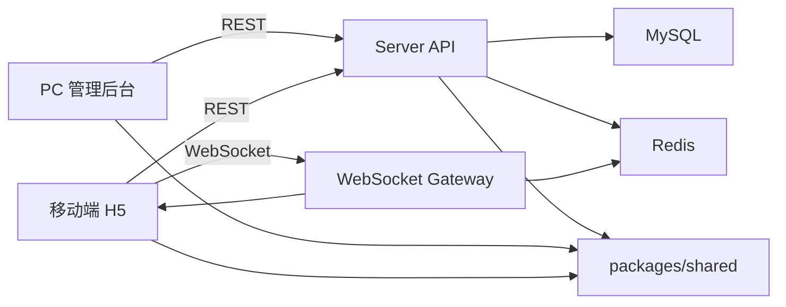
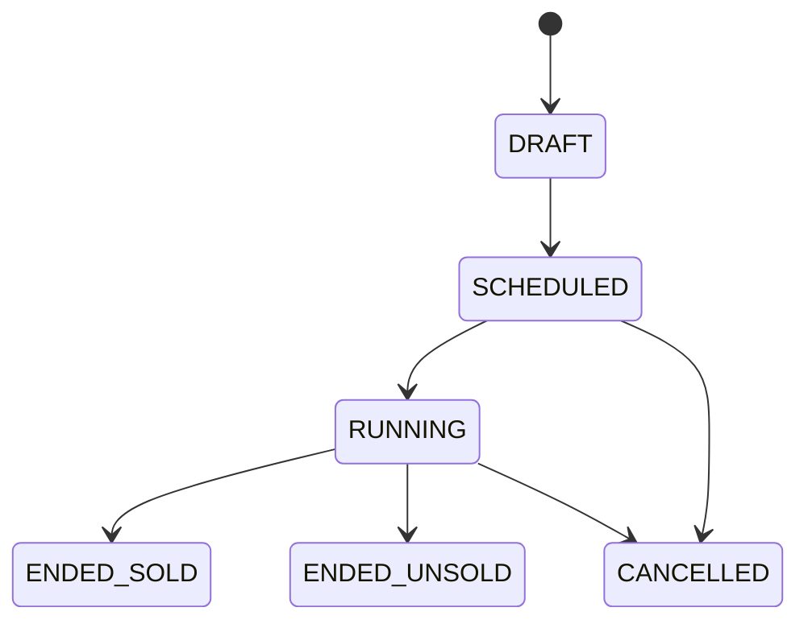

# 架构设计

本文档描述直播竞拍系统的模块边界、数据流和关键一致性策略。当前仓库不代表所有模块已经实现；实现代码必须保持状态机、出价引擎和 WebSocket 契约集中一致。

## 1. 架构目标

- 跑通商品上架、规则配置、直播间展示、实时出价、动态排名、竞拍结束、成交订单闭环。
- 将竞拍状态机、出价校验、结算逻辑集中在服务端。
- 使用 Redis 承接高频出价热状态，数据库保存权威业务记录。
- WebSocket 按房间隔离广播，断线后通过 snapshot 恢复。
- 所有金额使用整数分，所有公开事件、状态和错误码从 `packages/shared` 引用。

## 2. 模块划分

```txt
apps/admin
  PC 商家 / 主播后台
  - 商品创建
  - 规则配置
  - 竞拍启动 / 取消
  - 订单查看

apps/mobile
  移动端直播间 H5
  - 直播间展示
  - 竞拍小卡片
  - 底部竞拍面板
  - 实时提醒和结果展示

apps/server
  后端 API 和实时服务
  - Admin REST API
  - Public REST API
  - AuctionStateMachineService
  - BidService
  - AuctionSnapshotService
  - AuctionEventPublisherService
  - OrderService
  - Socket.IO WebSocket Gateway
  - AuctionScheduler

packages/shared
  共享契约
  - 竞拍状态
  - WebSocket 事件名和事件元信息
  - API 错误码
  - Snapshot 类型
```

## 3. 运行时架构



## 4. 数据流

### 4.1 创建与启动竞拍

```txt
后台创建商品
  -> 配置规则
  -> 创建 AuctionSession(SCHEDULED)
  -> 启动竞拍
  -> 状态机流转到 RUNNING
  -> 安排结束 timer
  -> 写 AuctionEvent
  -> 广播 AUCTION_STARTED
```

### 4.2 用户出价

```txt
移动端提交出价
  -> DTO 和 demo 身份校验
  -> Redis Lua 原子校验和更新热状态
  -> 写 Bid
  -> 写 AuctionEvent / outbox
  -> 必要时延时或触发封顶结算
  -> 广播 BID_ACCEPTED / OUTBID / LEADING / AUCTION_EXTENDED
```

### 4.3 竞拍结束

```txt
到达 endTime 或命中 capPriceFen
  -> AuctionStateMachineService.finishAuction
  -> DB transaction 条件更新状态
  -> 有最高出价人则创建唯一订单
  -> 写 AuctionEvent / AuditLog
  -> 清理或设置 Redis 热 key TTL
  -> 广播 AUCTION_ENDED / ORDER_CREATED
```

Day 7 当前实现状态：

- `AuctionStateMachineService.finishAuction` 已实现 DB 事务内结算。
- 有 `highestBidderId` 时流转 `ENDED_SOLD` 并创建唯一订单；无最高出价人时流转 `ENDED_UNSOLD`。
- `AuctionSchedulerService` 已实现单机 timer 和服务启动后的 `RUNNING` 竞拍恢复扫描。
- `BidService` 已实现 `POST /auctions/:auctionId/bids`，Redis 热状态在首次出价时按 DB 快照惰性初始化。
- 出价成功后已写 `Bid`、更新 `AuctionSession`，并写 `AuctionEvent(BID_ACCEPTED, outboxStatus=PENDING)`。
- Redis accepted 但 DB 写失败时记录 `AuditLog(DB_WRITE_FAILED_AFTER_REDIS_ACCEPTED)` 并返回 `BID_PERSISTENCE_FAILED`。
- `AuctionSnapshotService` 已提供房间竞拍列表、竞拍详情和重连 snapshot。
- `AuctionRealtimeGateway` 已支持 `user:{userId}`、`room:{roomId}`、`auction:{auctionId}` 房间加入、snapshot 请求、Socket.IO 出价和心跳。
- `AuctionEventPublisherService` 已从 DB outbox 发布 WebSocket 事件，并在成功后标记 `PUBLISHED`，失败时标记 `FAILED` 并写审计日志。
- Redis/DB 自动对账仍未落地，后续实现必须继续向上述目标数据流收敛。

Day 7 管理端实现状态：

- `apps/admin` 已接入管理端 API，提供竞拍列表、状态筛选、启动 / 取消操作和订单列表。
- 管理端页面只消费 API 状态，不实现竞拍状态机；启动和取消合法性仍由后端状态机兜底。
- 管理端 API DTO 已补充商品标签、商品图、买家脱敏名和竞拍状态等展示字段。

### 4.4 断线重连

```txt
客户端重连
  -> 加入 room:{roomId} 和 auction:{auctionId}
  -> 拉取 AUCTION_SNAPSHOT
  -> 用 snapshot.serverSeq 和 snapshot.serverTime 重建 UI
  -> 应用后续 serverSeq 更大的实时事件
```

## 5. 状态机

持久化状态：

```txt
DRAFT
SCHEDULED
RUNNING
ENDED_SOLD
ENDED_UNSOLD
CANCELLED
```

允许流转：



说明：

- 自动延时不使用独立持久状态，通过更新 `endTime` 和 `extendedCount` 表达。
- 非法流转必须抛业务异常。
- 订单创建必须由状态机结算流程触发，避免重复订单。
- `finishAuction` 必须用 `where id = ? and status = RUNNING` 这类条件更新兜底，防止多实例或重复 timer 造成重复结算。

## 6. 定时结束与延时调度

### 6.1 MVP 单机方案

个人开发阶段先采用单机内存调度，便于快速跑通闭环。Day 5 已落地该方案的启动注册、取消清理、启动恢复扫描和出价延时重排：

- `startAuction` 成功后，按 `endTime` 设置 `setTimeout`。
- 进程内维护 `auctionId -> timer` 映射。
- 出价触发自动延时后，先清理旧 timer，再按新的 `endTime` 设置新 timer。
- `cancelAuction` 或 `finishAuction` 后必须清理 timer。
- 服务重启后，通过扫描 `RUNNING` 竞拍恢复 timer；已经过期的竞拍立即调用 `finishAuction`。

单机方案的重复触发风险由数据库兜底：

- `finishAuction` 在事务中读取当前状态。
- 只允许 `RUNNING` 结束。
- 更新状态时带 `status = RUNNING` 条件。
- `Order(auctionId)` 唯一约束防止重复订单。

### 6.2 进阶多实例方案

并发和部署规模扩大后替换为：

- Redis delayed queue 或 BullMQ 负责结束任务。
- `finishAuction` 获取 distributed lock，例如 `lock:auction:{auctionId}:finish`。
- 锁过期时间必须小于可接受恢复窗口，并配合 DB 条件更新。
- 任务可重复投递，但结算必须幂等。

## 7. 数据模型

详细字段、索引和唯一约束见 `docs/database-schema.md`。核心实体：

- `User`
- `LiveRoom`
- `AuctionItem`
- `AuctionRule`
- `AuctionSession`
- `Bid`
- `Order`
- `AuctionEvent`
- `AuditLog`

关键约束：

- `Bid(auctionId, clientBidId)` 唯一。
- `Order(auctionId)` 唯一。
- 金额字段统一使用 `*Fen` 后缀。
- `AuctionSession.version` 用于并发控制或对账。
- `Bid.serverSeq` 和 `AuctionEvent.serverSeq` 用于 WebSocket 顺序控制。

## 8. Redis 热状态

推荐 key：

```txt
auction:{auctionId}:state
auction:{auctionId}:current_price_fen
auction:{auctionId}:highest_bidder_id
auction:{auctionId}:end_time_ms
auction:{auctionId}:bid_count
auction:{auctionId}:leaderboard
auction:{auctionId}:client_bid:{clientBidId}
```

当前实现中 `auction:{auctionId}:state` 是 hash，包含 `status`、`server_seq`、`extended_count`；其余 key 分别保存当前价、最高出价人、结束时间、出价次数、排行榜和单个 `clientBidId` 的热幂等记录。

出价 Lua 脚本负责：

- 校验竞拍状态。
- 校验出价金额和固定加价幅度。
- 校验最高出价人不能重复出价。
- 校验幂等 key。
- 分配单场单调递增 `serverSeq`。
- 更新当前价、最高出价人、出价次数和排行榜。
- 判断是否触发延时或封顶成交。

竞拍完成后，热 key 设置 TTL，保留足够时间给重连和对账使用。

## 9. 一致性策略

一致性分三层：

1. Redis Lua 保证实时出价路径原子性。
2. DB unique 约束保证 `clientBidId` 和订单唯一。
3. `auction_events` / outbox 记录待广播和待补偿事件。

原则：

- Redis 是热状态，数据库是权威业务记录。
- WebSocket 只作为实时通知，不作为唯一状态来源。
- 客户端以 snapshot 为准恢复状态。
- Redis 成功但 DB 失败时不得直接广播成功事件；必须记录补偿或返回可重试错误。

详细流程见 `docs/consistency.md`。

## 10. WebSocket

事件只发送到相关房间：

```txt
room:{roomId}
auction:{auctionId}
user:{userId}
```

所有竞拍业务服务端事件必须包含：

```txt
eventId
auctionId
roomId
serverSeq
serverTime
```

客户端必须按 `serverSeq` 处理乱序、重复和跳号事件。完整契约见 `docs/websocket-events.md`。

Day 6 实现边界：

- 当前 WebSocket 使用 Socket.IO，客户端身份优先从 `handshake.auth.userId` 和 `handshake.auth.role` 读取，也兼容 demo header。
- `BID_ACCEPTED` 按 outbox 事件广播到 `auction:{auctionId}`，并派生 `LEADING`、`OUTBID` 和可选 `AUCTION_EXTENDED` 私有/竞拍房间事件。
- `AUCTION_STARTED`、`AUCTION_ENDED`、`AUCTION_CANCELLED` 同时发送到 `room:{roomId}` 和 `auction:{auctionId}`。
- `ORDER_CREATED` 只发送到 `user:{buyerId}`。
- HTTP 出价失败仍只返回 API 错误；Socket.IO `placeBid` 失败会向当前用户房间发送 `BID_REJECTED`。
- 当前 outbox 发布器为单进程轮询，多实例部署需要补充事件 claim 或分布式锁。
