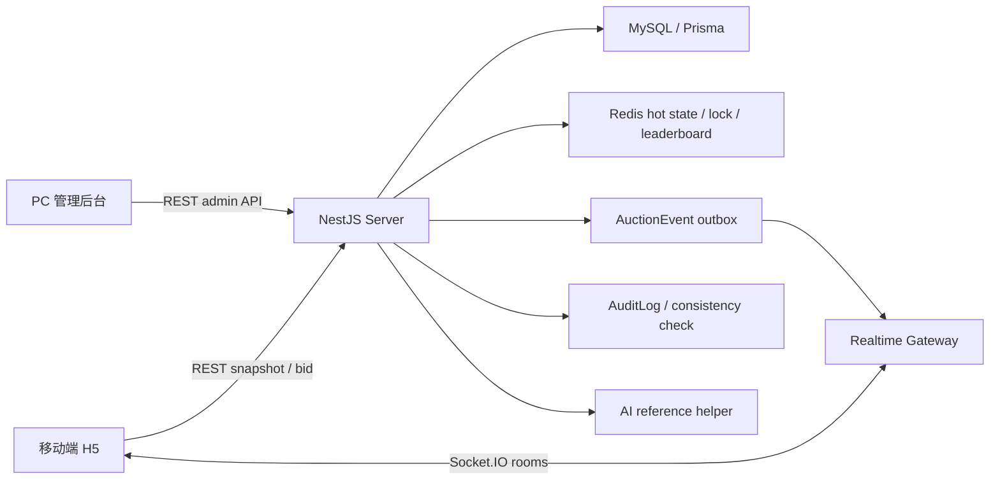
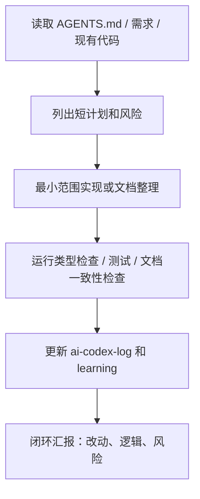

# 最终演示验收材料

日期：2026-06-03

本文档根据 `docs/demo-script.md` 第五项整理，作为最终提交页、录屏说明和答辩材料的统一来源。未执行的外部链接、真实压测或浏览器手测必须保留为“待填写 / 待测”，不得写成已完成。

## 1. 课题名称

直播竞拍全栈系统

可选副标题：面向抖音直播电商场景的实时竞拍系统。

## 2. 团队名称与成员名单

| 字段 | 内容 |
| --- | --- |
| 团队形式 | 个人完成 |
| 成员姓名 | 待按最终提交页填写 |
| 学校 / 专业 | 待按最终提交页填写 |
| 角色 | 全栈开发、产品设计、后端竞拍引擎、前端联调、文档和演示材料整理 |

## 3. 分工说明

本项目为个人完成，分工按模块说明：

- 产品与需求：拆解直播电商竞拍闭环、演示范围、非目标和验收口径。
- 后端：NestJS API、竞拍状态机、Redis Lua 出价引擎、订单结算、outbox、Socket.IO、对账审计和性能脚本。
- 前端：React 管理后台、移动端 H5 直播间、竞拍面板、实时出价反馈、结果弹窗和模拟支付入口。
- 数据与部署：Prisma schema、MySQL、Redis、seed、Docker Compose、生产 compose 和 CI。
- 文档与验证：API、WebSocket、架构、性能、手工测试、AI 协作日志和演示脚本。

## 4. 核心功能清单

1. 主播后台可创建商品、配置竞拍规则、启动竞拍、取消异常竞拍并查看订单。
2. 移动端 H5 模拟直播间，展示竞拍小卡片、底部半屏详情、倒计时、当前价、排行榜和出价结果。
3. 出价引擎使用 Redis Lua、Redis 分布式锁和 `clientBidId` 幂等，保证当前价单调、最高出价人唯一、重复点击不重复落库。
4. 竞拍状态机集中处理启动、取消、到期成交、到期流拍和封顶价立即成交，成交订单通过 `Order(auctionId)` 唯一约束防重复。
5. Socket.IO 按 `room:{roomId}`、`auction:{auctionId}`、`user:{userId}` 房间隔离事件，客户端重连后以 snapshot 恢复最新状态。
6. AI 竞拍参考助手支持后台生成 / 编辑适合人群、卖点话术和整数分参考价格区间，无 Key 时 deterministic mock/fallback，移动端展示脱敏参考卡片。
7. 提供真实 HTTP 30/100 并发压测数据、服务级 e2e、单元测试、手工验收清单和生产 compose 演示入口。

## 5. 端到端使用流程

1. 主播进入管理后台，在“商品上架”页面填写商品名称、图片、介绍和卖点，并配置起拍价、固定加价、封顶价、竞拍时长、防狙击窗口和延时时长。
2. 主播点击“AI 生成竞拍参考”，后端根据规则先推断整数分参考价格区间，再用 mock/OpenAI/Ark 生成适合人群、卖点话术和理性出价提示；主播可编辑结果并应用建议卖点、起拍价或封顶价。
3. 后端通过 `POST /admin/auctions/with-item` 在同一事务内创建商品、规则、`SCHEDULED` 竞拍并绑定 AI 参考，后台列表刷新后可启动。
4. 主播点击启动，竞拍进入 `RUNNING`，服务端注册结束 timer，并通过 outbox 向直播间和竞拍房间广播 `AUCTION_STARTED`。
5. 用户进入移动端直播间，页面拉取竞拍列表、详情、AI 参考和 snapshot，用 `serverTime` 校准倒计时，用 `serverSeq` 处理乱序事件。
6. 用户提交出价后，服务端完成 Redis 原子校验、DB 持久化、事件落库和房间广播；领先用户看到“当前您已是最高价”，被超越用户看到“你已被超越”。
7. 如果最后窗口内有效出价触发防狙击延时，服务端更新 `endTime` 并广播 `AUCTION_EXTENDED`；如果达到封顶价则立即成交。
8. 竞拍到期或封顶后，状态机结算为成交或流拍；成交时只生成一个订单，并向中拍用户发送 `ORDER_CREATED`。
9. 中拍用户在移动端结果弹窗查看订单并执行模拟支付，主播可在后台订单列表看到成交金额和订单状态。

## 6. 在线 Demo 链接

当前提供本地演示入口：

| 入口 | 地址 |
| --- | --- |
| 后端健康检查 | `http://localhost:3000/health` |
| 管理后台 dev | `http://localhost:5173/admin/items/new` |
| 移动端 dev 用户 A | `http://localhost:5174/?roomId=room_1&userId=user_1&auctionId=<auctionId>` |
| 移动端 dev 用户 B | `http://localhost:5174/?roomId=room_1&userId=user_2&auctionId=<auctionId>` |
| 生产 compose 后台 | `http://localhost:8080` |
| 生产 compose 移动端 | `http://localhost:8081` |

公网在线 Demo 链接：待填写。若最终没有公网部署，使用演示视频和本地启动说明替代。

## 7. 演示视频链接

演示视频链接：待填写。

建议视频结构：

- 0:00-0:30 项目目标和架构总览。
- 0:30-1:20 后台创建商品、配置规则、启动竞拍。
- 1:20-2:20 两个移动端用户交替出价、领先 / 被超越 / 延时。
- 2:20-2:50 封顶或到期成交、订单生成、模拟支付。
- 2:50-3:00 展示压测数据、测试命令和剩余边界。

## 8. 源代码仓库链接

| 字段 | 内容 |
| --- | --- |
| 仓库 | `https://github.com/Cslearner-wjl/live-auction-system.git` |
| 默认分支 | `main` |
| 本地整理前 HEAD | `298137c` |
| 最后提交记录 | 待最终提交后以 GitHub 页面为准 |

## 9. README / 运行说明

运行说明入口：根目录 `README.md`。

最小本地启动：

```powershell
pnpm install
docker compose up -d mysql redis
pnpm --filter @live-auction/server prisma:generate
pnpm --filter @live-auction/server prisma:migrate
pnpm --filter @live-auction/server prisma:seed
pnpm dev:server
pnpm dev:admin
pnpm dev:mobile
```

生产 compose 本地演示：

```powershell
docker compose -f docker-compose.prod.yml up -d --build
```

## 10. 系统架构图



关键边界：

- 状态机集中在 `AuctionStateMachineService`。
- 出价核心集中在 `BidService` 和 `RedisBidAtomicStore`。
- 事件发布集中在 `AuctionEventPublisherService`。
- 共享事件、状态和错误码来自 `packages/shared`。

## 11. 大模型 / AI 能力使用说明

项目主业务链路不依赖外部大模型。AI 相关使用分两类：

- 开发协作：使用 Codex 进行需求拆解、代码审视、测试补强和文档整理；过程记录在 `docs/ai-codex-log.md`。
- 产品功能：已实现 `POST /admin/ai/auction-insights` 和 `GET /auctions/:auctionId/ai-insight`。AI 只生成适合人群、卖点话术、参考价格区间和理性出价提示；无 `AI_API_KEY` 时返回 deterministic mock/fallback，支持 OpenAI Responses 和 Ark/Doubao OpenAI-compatible Chat Completions，密钥只在后端环境变量读取。

Agent 工作流：



## 12. 关键工程难点与解决方案

| 难点 | 风险 | 解决方案 |
| --- | --- | --- |
| 高并发出价 | 当前价倒退、重复最高价、重复订单 | Redis Lua 原子校验，Redis 分布式锁保护同场竞拍关键段，DB 唯一约束兜底幂等和订单唯一 |
| Redis accepted 后 DB 失败 | 热状态与 DB 快照不一致，错误事件误广播 | 成功事件必须先落库 outbox；DB 失败后按 `serverSeq` 安全回滚 Redis 并写审计 |
| WebSocket 乱序和重连 | 客户端依赖旧事件导致状态错误 | 所有服务端事件携带 `serverSeq` 和 `serverTime`，客户端以 snapshot 为权威恢复 |
| outbox 多实例发布 | 重复发布或漏发布 | outbox 增加 `PROCESSING`、claim/lease、尝试次数和 `DEAD_LETTER` |
| 演示数据污染 | 压测历史竞拍影响移动端默认选择 | seed 清理历史数据，移动端支持 `auctionId` 定向进入 |

## 13. 项目亮点 / 创新点

1. 将直播竞拍的价格、赢家、延时、封顶成交和订单结算统一到服务端状态机与原子出价链路中，避免 UI 或网关重复实现业务规则。
2. 用 outbox + snapshot-first 设计连接数据库事实和实时体验，WebSocket 只做通知，客户端重连后不会依赖旧事件恢复状态。
3. 演示材料明确区分已完成、已验证、待测和非目标，不把真实认证、真实支付、生产 compose 新环境实跑等未完成能力包装成成果。

## 14. 其余材料

| 材料 | 当前状态 | 入口 |
| --- | --- | --- |
| 性能指标 / 压测结果 | 已记录真实 HTTP 30/100 并发出价和 Socket.IO 100/1000 连接压测 | `docs/performance-report.md` |
| Prompt / Agent 策略 | 已记录 Codex 协作方式、决策和已知问题 | `docs/ai-codex-log.md` |
| 评测方案 | 单元测试、服务级 e2e、手工测试、压测一致性校验 | `docs/manual-test.md` |
| 用户反馈 / 内测记录 | 暂无正式用户反馈 | 待补 |

## 不可宣称已完成

- 真实公网在线 Demo。
- 真实支付、真实直播推流、真实认证 / 授权 / 限流。
- Playwright 浏览器全链路测试。
- 生产 compose 在新机器上的实际 build/up 记录。
- 自动修复型 Redis/DB 对账。
- AI 自动出价、AI 参与状态机裁决、专业鉴定估价或真实市场价值承诺。
- 对应的录屏、截图、测试报告，并发部分的测试。
