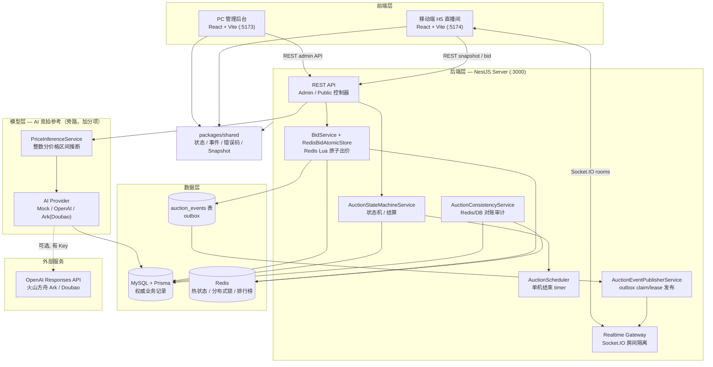
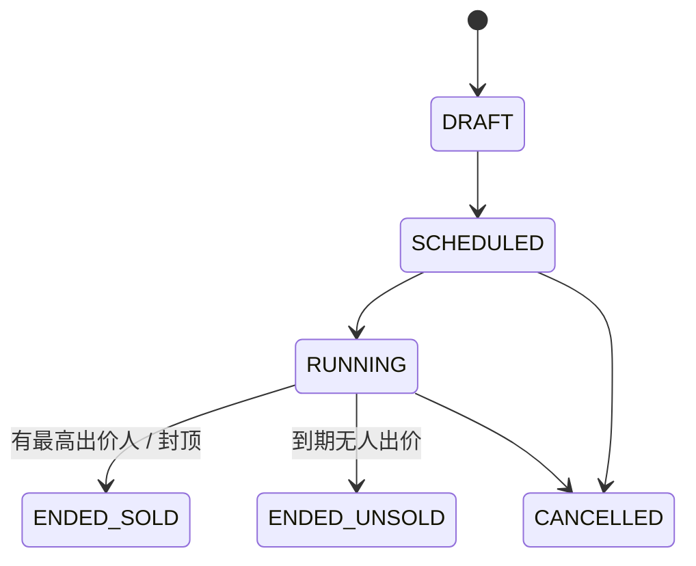
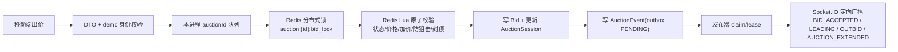
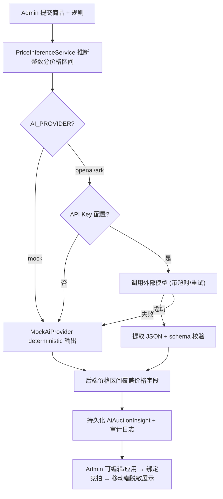

# 直播竞拍全栈系统 — 结营文档

> 本文档作为项目最终提交材料，对应提交页要求的 14 项内容并补充加分材料。所有“已完成 / 已验证”的描述以仓库实际代码和真实运行结果为准；尚未执行的公网部署、视频录制等保留占位，不包装为成果。

---

## 1. 课题名称

**直播竞拍全栈系统**

副标题：面向抖音直播电商场景的实时竞拍系统（商品上架 → 规则配置 → 直播间展示 → 实时出价 → 动态排名 → 竞拍结束 → 成交订单 → 模拟支付的完整闭环）。

---

## 2. 团队名称与成员名单

| 字段 | 内容 |
| --- | --- |
| 团队形式 | 个人完成 |
| 成员姓名 | 待按最终提交页填写 |
| 学校 / 专业 | 待按最终提交页填写 |
| 角色 | 全栈开发、产品设计、后端竞拍引擎、前端联调、数据与部署、文档与演示材料整理 |

---

## 3. 分工说明

本项目为个人独立完成，按模块说明承担的工作：

| 模块 | 负责内容 |
| --- | --- |
| 产品与需求 | 拆解直播电商竞拍闭环、明确演示范围、非目标和验收口径（见 `AGENTS.md`、`docs/requirements-analysis.md`） |
| 后端 | NestJS API、竞拍状态机、Redis Lua 原子出价引擎、Redis 分布式锁、订单结算、outbox 事件发布、Socket.IO 实时网关、Redis/DB 对账审计、性能压测脚本 |
| 前端 | React 管理后台（商品 / 规则 / 竞拍 / 订单 CRUD）、移动端 H5 直播间（竞拍面板、倒计时、排行榜、实时出价反馈、结果弹窗、模拟支付入口、AI 参考卡片） |
| AI 功能 | AI 竞拍参考助手：价格区间推断、Mock/OpenAI/Ark Provider、输出 JSON 校验脱敏、审计日志 |
| 数据与部署 | Prisma schema、MySQL、Redis、seed、dev / 生产 Docker Compose、GitHub Actions CI |
| 文档与验证 | 单元测试、服务级 e2e、Playwright、手工测试清单、性能报告、AI 协作日志、演示脚本 |

---

## 4. 核心功能清单

1. **主播后台管理**：创建商品（含本地图片上传）、配置竞拍规则（0 元起拍、固定加价、封顶价、竞拍时长、防狙击窗口）、启动 / 取消竞拍、查看竞拍列表与成交订单。
2. **移动端直播间**：模拟直播间 H5，展示竞拍小卡片、底部半屏详情面板、当前价、倒计时、参与人数、实时排行榜与“领先 / 被超越”反馈。
3. **高一致性出价引擎**：Redis Lua 原子校验状态 / 价格 / 加价幅度 / 防狙击 / 封顶，配合 Redis 分布式锁与 `clientBidId` 幂等，保证当前价单调递增、最高出价人唯一、重复点击不重复落库。
4. **集中式竞拍状态机**：统一处理启动、取消、到期成交、到期流拍与封顶价立即成交；成交订单由 `Order(auctionId)` 唯一约束与 DB 事务防重复结算。
5. **实时事件与断线恢复**：Socket.IO 按 `room`/`auction`/`user` 房间隔离广播，事件携带 `serverSeq`/`serverTime`；客户端丢弃旧事件、跳号时重拉 snapshot 恢复权威状态。
6. **AI 竞拍参考助手**：后台一键生成 / 编辑「适合人群、卖点话术、整数分参考价格区间、风险提示」，无 Key 时 deterministic mock/fallback；移动端展示脱敏参考卡片与理性出价提醒。
7. **工程化与可验证性**：真实 HTTP 30/100 并发压测、Socket.IO 100/1000 连接压测、服务级 e2e、单元测试、手工验收清单、生产 Compose 一键演示与 CI 流水线。

---

## 5. 端到端使用流程

1. 主播进入管理后台「商品上架」页，填写商品名称、图片、介绍、卖点，并配置起拍价、固定加价、封顶价、竞拍时长、防狙击窗口和延时规则。
2. 主播点击「AI 生成竞拍参考」，后端先按规则推断整数分参考价格区间，再用 Mock/OpenAI/Ark 生成文案；主播可编辑结果并一键应用建议卖点 / 起拍价 / 封顶价。
3. 后端通过 `POST /admin/auctions/with-item` 在同一事务内创建商品、规则、`SCHEDULED` 竞拍并绑定 AI 参考。
4. 主播点击「启动」，竞拍进入 `RUNNING`，服务端注册结束 timer，并经 outbox 广播 `AUCTION_STARTED` 到直播间。
5. 用户打开移动端直播间，页面拉取竞拍列表、详情、AI 参考与 snapshot，用 `serverTime` 校准倒计时、用 `serverSeq` 处理乱序事件。
6. 用户提交出价，服务端完成 Redis 原子校验 → DB 持久化 → outbox 落库 → 房间广播；领先者看到「当前最高价」，被超越者收到「你已被超越」。
7. 若最后窗口内有效出价触发防狙击延时，服务端延长 `endTime` 并广播 `AUCTION_EXTENDED`；达到封顶价则立即成交。
8. 竞拍到期或封顶后，状态机结算为成交（`ENDED_SOLD`，唯一订单）或流拍（`ENDED_UNSOLD`），并向中拍用户推送 `ORDER_CREATED`。
9. 中拍用户在结果弹窗查看订单并执行 `POST /orders/:orderId/mock-pay` 模拟支付，主播可在后台订单列表看到成交金额与订单状态。

---

## 6. 在线 Demo 链接

### 6.1 公网 Demo（当前有效，2026-06-09）

通过 Cloudflare 临时 tunnel 将本地 `docker-compose.prod.yml` 全栈容器暴露到公网 HTTPS：

| 入口 | 公网地址 |
| --- | --- |
| 后端健康检查 | `https://chocolate-tuner-techno-suggestions.trycloudflare.com/health` |
| 管理后台 | `https://screenshots-tyler-incident-advisory.trycloudflare.com/admin/items/new` |
| 移动端用户 A | `https://katrina-fast-thousand-led.trycloudflare.com/?roomId=room_1&userId=user_1` |
| 移动端用户 B | `https://katrina-fast-thousand-led.trycloudflare.com/?roomId=room_1&userId=user_2` |

**部署方式：** 本地 Docker Desktop 运行 `docker compose -f docker-compose.prod.yml up -d --build`，5 个容器（server / mysql / redis / admin-nginx / mobile-nginx）全部 healthy。分别用三个 `cloudflared.exe tunnel --url` 进程将 `localhost:3000`、`localhost:8080`、`localhost:8081` 暴露到公网 HTTPS。

**验证结果（全部通过）：**

| 检查项 | 结果 |
| --- | --- |
| 5 个 Compose 容器状态 | 全部 healthy |
| 公网 `/health` | 200，MySQL/Redis 连通 |
| 公网 REST API | 可访问 |
| Socket.IO 公网连接 | 连接 → 加入房间 → 请求 snapshot 成功 |
| Playwright 打开 admin/mobile 页面 | 未出现 `Failed to fetch` |

**重要限制：** 链接依赖本地电脑保持开机、Docker Desktop 运行、3 个 `cloudflared.exe` 进程不关闭。电脑睡眠、重启、关 Docker 或关 tunnel 后链接失效。Cloudflare 临时 tunnel 适合数天 Demo 演示，不是正式生产环境。

### 6.2 本地演示入口

| 入口 | 地址 |
| --- | --- |
| 后端健康检查 | `http://localhost:3000/health` |
| 管理后台（dev） | `http://localhost:5173/admin/items/new` |
| 移动端用户 A（dev） | `http://localhost:5174/?roomId=room_1&userId=user_1&auctionId=<auctionId>` |
| 移动端用户 B（dev） | `http://localhost:5174/?roomId=room_1&userId=user_2&auctionId=<auctionId>` |
| 生产 Compose 后台 | `http://localhost:8080` |
| 生产 Compose 移动端 | `http://localhost:8081` |

---

## 7. 演示视频链接

**演示视频链接：** `待填写`（建议 3 分钟内，可加速）

建议视频结构：

- `0:00–0:30` 项目目标与架构总览。
- `0:30–1:20` 后台创建商品、AI 生成参考、配置规则、启动竞拍。
- `1:20–2:20` 两到三个移动端用户交替真实出价，展示领先 / 被超越 / 防狙击延时。
- `2:20–2:50` 封顶或到期成交、唯一订单生成、模拟支付。
- `2:50–3:00` 展示 30/100 并发压测数据、测试命令与剩余边界。

---

## 8. 源代码仓库链接

| 字段 | 内容 |
| --- | --- |
| 主仓库 | `https://github.com/Cslearner-wjl/live-auction-system.git` |
| 默认分支 | `main`（用于评审与 PR） |
| 最近提交 | `d1c42a5 Refine mobile auction card layout and restore payment flow`（2026-06-07） |
| 最后提交记录 | 以最终提交后的 GitHub 页面为准 |

---

## 9. README / 运行说明

完整运行说明见根目录 [README.md](../README.md)，包含项目简介、技术栈、目录结构、配置说明和验证命令。

**最小本地启动：**

```powershell
pnpm install
docker compose up -d mysql redis
pnpm --filter @live-auction/server prisma:generate
pnpm --filter @live-auction/server prisma:migrate
pnpm --filter @live-auction/server prisma:seed
pnpm dev:server   # :3000
pnpm dev:admin    # :5173
pnpm dev:mobile   # :5174
```

**生产 Compose 一键演示：**

```powershell
docker compose -f docker-compose.prod.yml up -d --build
```

**验证命令：**

```powershell
pnpm typecheck && pnpm test && pnpm test:e2e && pnpm lint && pnpm build
```

**目录结构：**

```txt
apps/
  admin/          # React + Vite 管理后台 (:5173)
  mobile/         # React + Vite 移动端 H5 直播间 (:5174)
  server/         # NestJS API + Socket.IO 实时服务 (:3000)
packages/
  shared/         # 共享状态、事件名、错误码、Snapshot 类型
docs/             # 架构、一致性、API、WebSocket、性能、AI 等契约文档
```

---

## 10. 系统架构图

### 10.1 运行时架构（前端 / 后端 / 模型层 / 数据层 / 外部服务）



### 10.2 竞拍状态机



### 10.3 出价数据流



关键边界：状态机集中在 `AuctionStateMachineService`；出价核心集中在 `BidService` 与 `RedisBidAtomicStore`；事件发布集中在 `AuctionEventPublisherService`；共享契约统一来自 `packages/shared`。详见 [docs/architecture.md](architecture.md)。

---

## 11. 大模型 / AI 能力使用说明

项目**主业务链路不依赖外部大模型**。AI 能力分为两类：

### 11.1 产品功能：AI 竞拍参考助手

1. **接口**：`POST /admin/ai/auction-insights`（生成）、`GET /auctions/:auctionId/ai-insight`（移动端脱敏读取）
2. **模型 / API**：支持三种 Provider：`mock`（默认，deterministic）、`openai`（OpenAI Responses API）、`ark`（火山方舟 Ark / Doubao，OpenAI 兼容 Chat Completions）
3. **在系统中的位置**：旁路模块，**不参与**出价、状态机、订单结算和 WebSocket 事件链路
4. **Prompt 方案**：强约束 system prompt：只输出 JSON、禁止 Markdown、禁止声称专业鉴定 / 真实估价、必须提示理性出价；user prompt 注入商品信息、规则、后端价格区间和目标 JSON schema
5. **价格安全**：模型只产出文案；**所有整数分价格字段由后端 `PriceInferenceService` 覆盖**，避免模型输出非法单位 / 越界价格
6. **容错兜底**：无 `AI_API_KEY` 或模型异常时自动 fallback 到 Mock（`source=fallback`），并写 `AI_GENERATION_FALLBACK` 审计日志；密钥仅从后端环境变量读取，不进源码 / 前端
7. **输出字段**：适合人群、卖点标签、直播话术、氛围文案、参考成交区间、封顶 / 警示价、价格解释、风险提示、置信度

AI Agent 工作流：



### 11.2 开发协作：AI 辅助工程

使用 Codex / Claude Code 进行需求拆解、代码审视、测试补强与文档整理，过程与决策记录在 [docs/ai-codex-log.md](ai-codex-log.md)。

---

## 12. 关键工程难点与解决方案

| 难点 | 风险 | 解决方案 |
| --- | --- | --- |
| 高并发出价 | 当前价倒退、重复最高价、重复订单 | Redis Lua 单脚本原子校验 + 更新；Redis 分布式锁 auction:{id}:bid_lock 保护同场关键段；DB 唯一约束 Bid(auctionId, clientBidId) 与 Order(auctionId) 兜底幂等 |
| Redis accepted 后 DB 写失败 | 热状态与权威记录不一致、错误广播成功 | 成功事件先落 outbox 再广播；DB 失败后按 serverSeq 安全回滚 Redis 热状态，写 DB_WRITE_FAILED_AFTER_REDIS_ACCEPTED 审计并返回可重试错误码 |
| WebSocket 乱序与断线重连 | 客户端依赖旧事件导致状态错误 | 所有事件携带 serverSeq / serverTime；客户端丢弃旧 seq、跳号时重拉 snapshot，以 snapshot 为权威状态来源 |
| outbox 多实例发布 | 重复发布或漏发布 | outbox 引入 PROCESSING claim / lease、尝试次数上限和 DEAD_LETTER，lease 过期可被其他实例重领 |
| AI 输出不可控 | 模型输出非法价格 / 单位 / 诱导消费 | 强约束 prompt + 后端价格区间覆盖 + JSON schema 校验 + 无 Key / 异常 fallback，AI 全程旁路不影响主链路 |
| 演示数据污染 | 压测历史竞拍影响移动端默认选择 | seed 清理历史数据，移动端支持 auctionId 定向进入

---

## 13. 项目亮点 / 创新点

1. **服务端集中式竞拍引擎**：将价格、赢家、防狙击延时、封顶成交与订单结算统一到「状态机 + Redis Lua 原子出价 + 分布式锁 + DB 唯一约束」多层一致性体系，UI 与网关不重复实现任何业务规则。
2. **outbox + snapshot-first 实时架构**：用 outbox 连接「DB 事实」与「实时体验」，WebSocket 仅作通知通道，客户端重连后完全以 snapshot 恢复，不依赖历史事件，保证最终一致与可恢复。
3. **AI 旁路且安全的参考助手**：模型只产出文案、价格由后端推断覆盖、无 Key 自动 deterministic fallback、密钥不落源码、对用户脱敏并强调理性出价 —— 在提供 AI 加分能力的同时不污染核心交易链路。

---

## 14. 其余材料（加分项）

| 材料 | 当前状态 | 入口 |
| --- | --- | --- |
| 性能指标 / 压测结果 | 真实 HTTP 30/100 并发出价 + Socket.IO 100/1000 连接压测（见下） | [docs/performance-report.md](performance-report.md) |
| Prompt 策略 / Agent 流程 | AI 参考 Prompt 模板、Provider 选择与 fallback 机制；Codex 协作记录 | 本文 §11、[docs/ai-codex-log.md](ai-codex-log.md) |
| 评测方案与样例 | 单元测试、服务级 e2e、Playwright、手工测试、压测一致性校验 | [docs/manual-test.md](manual-test.md)、[docs/ai验收.md](ai验收.md) |
| 用户反馈 / 内测记录 | 暂无正式用户反馈 | 待补 |

### 14.1 性能压测结果摘要

| 场景 | 规模 | 结果 | 一致性校验 |
| --- | --- | --- | --- |
| HTTP 并发出价 | 30 | accepted 24/30，p95 873.41ms，6 个受控低价拒绝 | 通过：Redis/DB/snapshot/订单一致 |
| HTTP 并发出价 | 100 | accepted 80/100，avg 1905.17ms，p95 3516.74ms | 通过：当前价 100000、最高出价人唯一、无重复订单 |
| Socket.IO 连接 | 100 | 连接/join/snapshot/PING-PONG 100%，连接 p95 55.47ms | 通过 |
| Socket.IO 连接 | 1000 | 连接/join/snapshot/PING-PONG 100%，连接 p95 501.42ms | 通过 |

> 数据为本机 dev server + Docker MySQL/Redis 实测，体现「一致性优先于吞吐」的取舍，不作为生产性能承诺。

---

## 附：已知边界（不视为缺陷，不在本期范围内"修复"）

- 结束调度为单机 `setTimeout`，多实例需切换 Redis delayed queue / BullMQ。
- demo 身份基于 `x-demo-user-id`/`x-demo-role` header，不适合公网。
- Redis/DB 对账只检测并写审计，不自动修复。
- 公网 Demo 基于 Cloudflare 临时 tunnel + 本地 Docker Desktop，电脑关机 / 休眠 / Docker 或 tunnel 进程关闭后链接失效，适合短期演示，非正式生产环境。
- 真实支付、真实直播推流、Playwright 全链路覆盖与生产 Compose 非本机部署待补。
